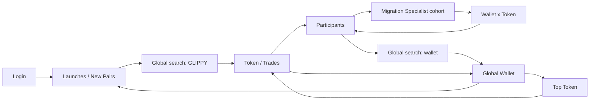

# Aladdin Canonical Information-Flow Specification

Status: implementation reference, pre-production  
Scope: canonical journey only  
Classification: Supporting Research  
Primary operating metric: time-to-trustworthy-evidence; secondary metrics: stale-data errors, contradictory values, context-loss rate.

## 1. Canonical flow



Data path:

```text
Pump.fun + Solana RPC/indexer + price feed + token metadata
→ ingestion with source timestamps and cursor checkpoints
→ canonical transaction/token/wallet normalization
→ wallet attribution and cost-basis reconstruction
→ versioned behaviour labelling
→ token, cohort, wallet-token and wallet-wide aggregates
→ hot cache + query API + scoped live channels
→ Aladdin workspace
→ user drill-down
→ route change or next scoped request
```

## 2. Screen-by-screen flow

| Surface | Entry and route | Required state and data | Requests and updates | Actions and navigation | Back/loading/failure | Risk and controlled adjustment |
|---|---|---|---|---|---|---|
| Login | Protected deep link or landing; `/login?returnTo=…` | `returnTo`, auth status | Auth request only; no market request | Mock/real login → `returnTo` | Preserve full encoded route; inline auth error | Open redirect risk: allow only internal `/app/*` routes |
| Launches / New Pairs | Login or Launches nav; `/app/launches/new` | tab, filters, sort, cursor; token summaries, freshness, quality | `GET /launches?stage=new`; SSE for inserts and material changes | Token item → Trades; nested Watchlist/explorer does not navigate; search → resolver | Restore filter/cursor/scroll; row skeletons; stale snapshot remains visible | Continuous reordering disrupts scanning: buffer new rows behind “N new launches” control |
| Search GLIPPY | Global search; query in URL only when submitted | query, detected entity, ambiguity set | `GET /search?q=GLIPPY`; cached metadata | Unique token → token route; ambiguity → compact selector | Keep shell; suggestion skeleton; no-result/error retains query | Symbol ambiguity: contract is canonical identity, never symbol |
| Token / Trades | `/app/token/:contract/trades` | contract, tab, chart timeframe, trade filters/cursor; token summary + market snapshot | Parallel `GET /tokens/:contract` and first trades page; price/trade live channels only while active | Tab changes route; behaviour → Wallet×Token; wallet/tx explorer explicit | Return to origin; partial summary before trades; stale badge per dataset | Do not refetch summary per tab. Shared token query plus lazy tab queries |
| Participants | `/app/token/:contract/participants` | contract, tab, cohort sort/filter/cursor; inherited token summary | `GET /tokens/:contract/participants`; aggregate deltas at 2–5s cadence | Behaviour → cohort | Restore table state/scroll/chart; inherited quality; partial cohort rows allowed | Streaming trades and cohorts can diverge: show independent `asOf` and reconciliation status |
| Behaviour Group | `/app/token/:contract/behaviours/:behaviour` | contract, behaviour, origin; cohort totals and wallet page | `GET …/behaviours/:behaviour` | Wallet → contextual Wallet×Token | Back → same Participants state; table skeleton; incomplete-wallet flag | Large cohorts: cursor pagination, never embed all wallets in parent payload |
| Wallet × Token | `/app/token/:contract/wallets/:wallet` | token, wallet, origin; position, cost basis, token-specific events and evidence | `GET …/wallets/:wallet`; poll position every 10–15s when open | Explicit Back to Participants; explorer links only | Preserve origin; render known events before PnL; “cost basis incomplete” rather than estimated certainty | Cost-basis gaps are critical. PnL must be nullable with coverage details |
| Global Wallet | Search only; `/app/wallet/:wallet` | wallet, wallet-wide period, top-token cursor; identity, behaviour versions, performance, relationships, quality | `GET /wallets/:wallet`; lazy `GET /wallets/:wallet/tokens` | Top Token → Token/Trades; no sidebar destination | Back → stored origin/Launches; independent panel skeletons; incomplete history persistent | Wallet history is expensive. Summary and top tokens are separate requests |
| Top Token → Token | Top-token action | contract plus `origin=/app/wallet/:wallet` in history state | Reuse cached token metadata; request current market snapshot | Opens Token/Trades | Back restores global wallet period/scroll | Never duplicate wallet-wide data inside token response |

## 3. Layer definitions

| Layer | Input → transformation → output | Persistence/update | Failure and consumers |
|---|---|---|---|
| Raw transactions | RPC/indexer events → decoded swaps/transfers → canonical events | Immutable event store; near-real-time | Gaps recorded, never silently filled; trades, positions, cohorts |
| Token metadata | Pump.fun/metadata sources → contract-keyed normalization → identity/stage/authorities | Durable with change history; event-driven + periodic verification | Source conflict exposed; Launches and Token |
| Market data | DEX/price sources → OHLCV/liquidity normalization → snapshots/candles | Time-series; seconds | Stale timestamp; Launches/chart |
| Wallet attribution | Funding/ownership evidence → versioned relationships → wallet/cluster facts | Durable versioned graph; batch + events | Confidence and provenance required; wallet/cohort views |
| Behaviour labels | Wallet events/features → versioned rule/model → wallet-token labels | Versioned derivation; incremental | Unknown is valid; never convert label uncertainty into token verdict |
| Aggregates | Canonical events → token/cohort/wallet rollups → query tables | Materialized views + hot cache | `asOf`, coverage and reconciliation status included |
| Historical formations | Closed observation windows → cohort matching → evidence matches | Batch/static; hours | Coverage limits visible; Historical Match only |
| Display formatting | Typed API values → currency/address/time formatting | Frontend only | Must not change meaning or perform business calculations |

## 4. Data ownership

| Dataset | Launches | Token | Participants | Group | Wallet×Token | Global Wallet |
|---|---:|---:|---:|---:|---:|---:|
| Token metadata | ✓ | owner | inherited | inherited | inherited | token history only |
| Live market | summary | owner | inherited | inherited | inherited | optional |
| Trades | summary | owner | aggregate | filtered aggregate | wallet-token subset | wallet-wide subset |
| Wallet labels | summary | composition | owner | owner | contextual owner | wallet-wide owner |
| Holder state | summary | owner | aggregate | optional | position only | optional holdings |
| PnL | — | selected tables | — | — | token-specific | wallet-wide |
| Data quality | compact | full | inherited + cohort | contextual | contextual | full |

Fetch once/reuse: token metadata, market snapshot, label dictionary, wallet identity, quality envelope. Never calculate PnL, cohort totals, holder concentration or labels independently in multiple screens.

## 5. Minimal API contracts

All responses use:

```ts
type Quality = { asOf: string; freshnessMs: number; coveragePct: number;
  status: 'complete'|'partial'|'stale'|'unavailable'; gaps?: string[]; sourceVersions: Record<string,string> };
type Page<T> = { data: T[]; nextCursor: string|null; quality: Quality };
```

| Endpoint | Parameters / response | Pagination, cache, latency | Consumers / partial behaviour |
|---|---|---|---|
| `GET /launches` | `stage,new|migrated|trending; sort; filters; cursor; limit`; `Page<LaunchSummary>` | Cursor; CDN/private cache 2s; p95 250ms | Launches; return available rows with quality envelope |
| `GET /search` | `q, chain, limit`; discriminated `TokenHit|WalletHit` | No cursor initially; cache token hits 30s; p95 300ms | Global search; ambiguity returned explicitly |
| `GET /tokens/:contract` | optional `include=market,quality`; `TokenDetail` | Cache metadata 5m, market 2s; p95 250ms | All token tabs; partial market does not hide identity |
| `GET /tokens/:contract/trades` | `cursor,limit,side,behaviour,from,to,sort`; `Page<Trade>` | Cursor; 1s cache; p95 350ms | Trades; rows may omit nullable PnL with reason |
| `GET /tokens/:contract/participants` | `window,cursor,limit,sort`; `Page<Cohort>` | Cursor; 2s cache; p95 400ms | Participants; aggregates carry independent `asOf` |
| `GET /tokens/:contract/behaviours/:behaviour` | `cursor,limit,sort`; `CohortDetail + Page<CohortWallet>` | Cursor; 5s cache; p95 450ms | Group; return totals even if wallet page partial |
| `GET /tokens/:contract/wallets/:wallet` | `include=events,evidence,position`; `WalletTokenEvidence` | Event cursor; 5s cache; p95 500ms | Wallet×Token; cost basis and PnL nullable |
| `GET /wallets/:wallet` | `period`; `WalletSummary` | Cache 30s; p95 600ms | Global Wallet header/KPIs; independent section statuses |
| `GET /wallets/:wallet/tokens` | `period,cursor,limit,sort`; `Page<WalletTokenSummary>` | Cursor; cache 30s; p95 500ms | Top Tokens; load independently |

Sorting fields are allow-listed. Cursors are opaque. Every numerical field is raw numeric plus unit/currency metadata; the backend never returns preformatted `$42K` strings.

## 6. Live-update strategy

| Information | Transport | Frequency / stale threshold | Reconnect behaviour |
|---|---|---|---|
| New launches | SSE | push; stale 10s | resume by event ID, then snapshot reconcile |
| Token price/OHLC | WebSocket | 250ms–1s; stale 5s | gap marker then candle snapshot |
| Migration/liquidity/holders | polling or multiplexed WS | 3–10s; stale 20s | refetch token snapshot |
| Active token trades | WebSocket | event-driven; stale 5s | cursor backfill before live resumes |
| Participant aggregates | polling/SSE | 2–5s; stale 15s | replace aggregate snapshot; do not replay UI deltas |
| Wallet labels | cached request | minutes/version change; stale 15m | background refetch |
| Realised PnL | cached polling | 30–60s; stale 2m | refetch summary; preserve old value with stale label |
| Historical Match | static cached | hours | retry manually/background |

Only the active workspace/tab subscribes. Changed values receive a restrained 1–2 second highlight. Disconnected state keeps last-known values and timestamps; it never blanks the screen.

## 7. State ownership

- URL: contract, wallet, selected token tab, behaviour, submitted search query. Shareable and reload-safe.
- History/session state: origin route, Launches/table scroll, cursor/page, filters, sort, chart timeframe. Restores investigation without polluting share links.
- Server-state cache: token, trades, cohorts, wallet performance, evidence. Query keys contain contract/wallet, filters, cursor and data version. Use stale-while-revalidate with request deduplication.
- Local UI: open dropdowns/modals, expanded evidence, hover, copy toast. Component state only.

Recommended model: route library + query cache (TanStack Query equivalent) + a small typed navigation-context store backed by `history.state`/`sessionStorage`. Do not put server payloads in a global UI store.

## 8. Bottlenecks

| Rank | Bottleneck | Cause / product impact | Mitigation | Figma change? |
|---|---|---|---|---|
| Critical | Cost-basis/incomplete wallet history | PnL can be wrong, changing risk decisions | Nullable PnL, coverage window, gap reasons, reconciliation jobs | Yes: persistent evidence-quality treatment |
| Critical | Stream/aggregate divergence | Trades and participant totals disagree | Independent `asOf`, sequence IDs, periodic snapshot reconcile | Small timestamp/status addition |
| High | Repeated token fetches | Tab navigation adds latency/contradictions | Shared token query; lazy tab queries | No |
| High | Nested context restoration | Back loses investigative state | route identity + history/session restoration contract | Small explicit Back/origin treatment |
| High | Ambiguous symbols | Wrong token opened | resolve to contracts; selector with liquidity/MC/age | Already approved |
| High | Large histories/cohorts | Heavy payload and slow mobile tables | cursor pagination, virtualization, server filtering | Yes: visible pagination/load-more |
| Medium | Holder concentration cost | expensive real-time recomputation | materialized snapshots, lower cadence | Add `asOf`; no layout redesign |
| Medium | Deep-link auth | intended route lost | validated `returnTo` | No |
| Medium | Mobile density | horizontal overflow and hidden actions | pinned identity, horizontal table viewport, column priority | Responsive adjustment only |
| Low | Formatting duplication | inconsistent rounding | shared frontend formatters | No |

## 9. Controlled design deviations

| Current design | Implementation issue | Proposed change | User impact | Decision |
|---|---|---|---|---|
| Full tables immediately | Payload and render cost | First page + cursor continuation/virtualization | Faster evidence | Change |
| Every visible panel appears live | Subscription cost/noise | Stream active workspace/tab only | No material loss | Change |
| Generic Back | Context loss | Explicit origin-aware Back plus browser history | Better continuity | Change |
| Static values | Freshness unclear | `asOf`, stale/disconnected and restrained change flash | More trustworthy | Change |
| Wallet PnL always present | Cost basis may be incomplete | Nullable value + coverage/gap explanation | Prevents false confidence | Change |
| Launch list reorders immediately | User loses scanning position | Buffer incoming launches behind count | Stable scanning | Change |
| Desktop tables compressed on mobile | Unusable density | pinned identity + horizontal viewport/column priority | Same meaning, usable | Change |
| Token shell repeated across tabs | duplicate requests/layout | persistent token shell; lazy child data | Faster switching | Change |

The remaining visual system stays unchanged.

## 10. Dependency-based implementation plan

| Phase | Dependency | Deliverable / acceptance | Blocked by |
|---|---|---|---|
| 1. Canonical model | source definitions | IDs, numeric units, quality envelope; same fixture values everywhere | behaviour/version definitions |
| 2. Router/context | route map | refresh/deep link/Back restores exact investigation | none |
| 3. Search resolver | canonical IDs | token/wallet/ambiguity/no-result tested | search index contract |
| 4. Launches contract | ingestion summary | paginated new launches, buffered updates | source freshness SLA |
| 5. Token summary | metadata/market | one shared token query across tabs | normalized price/liquidity |
| 6. Lazy token tabs | token summary | active tab only fetches/subscribes | endpoint contracts |
| 7. Cohort drill-down | labels/aggregates | Participants → cohort with consistent totals | reconciliation strategy |
| 8. Wallet×Token | attribution/cost basis | contextual evidence with explicit gaps | cost-basis coverage |
| 9. Global Wallet | wallet aggregates | search-only wallet workspace and Top Token return | wallet history SLA |
| 10. Live layer | sequence IDs | reconnect/backfill/stale tests | transport choice |
| 11. Failure states | quality envelope | partial/stale/unavailable never imply certainty | error taxonomy |
| 12. Responsive | stable contracts | canonical journey usable at mobile widths | column priority approval |

## 11. Product approvals still required

1. Minimum wallet-history coverage required before realised PnL is displayed.
2. Whether behaviour labels require confidence/provenance in every surface or only expanded evidence.
3. Default Launches sort and whether buffered new launches auto-apply after inactivity.
4. Mobile column priority for each dense table.
5. Retention windows for raw events, candles, wallet positions and historical formations.
6. Source-of-truth precedence when Pump.fun, RPC/indexer and price feeds disagree.
7. Target freshness/latency SLAs by plan tier.
8. Whether external explorer links use Solscan by default or a user-configurable explorer.

No production UI or endpoints should proceed past the relevant phase until its blocked-by item has an owner and acceptance threshold.
